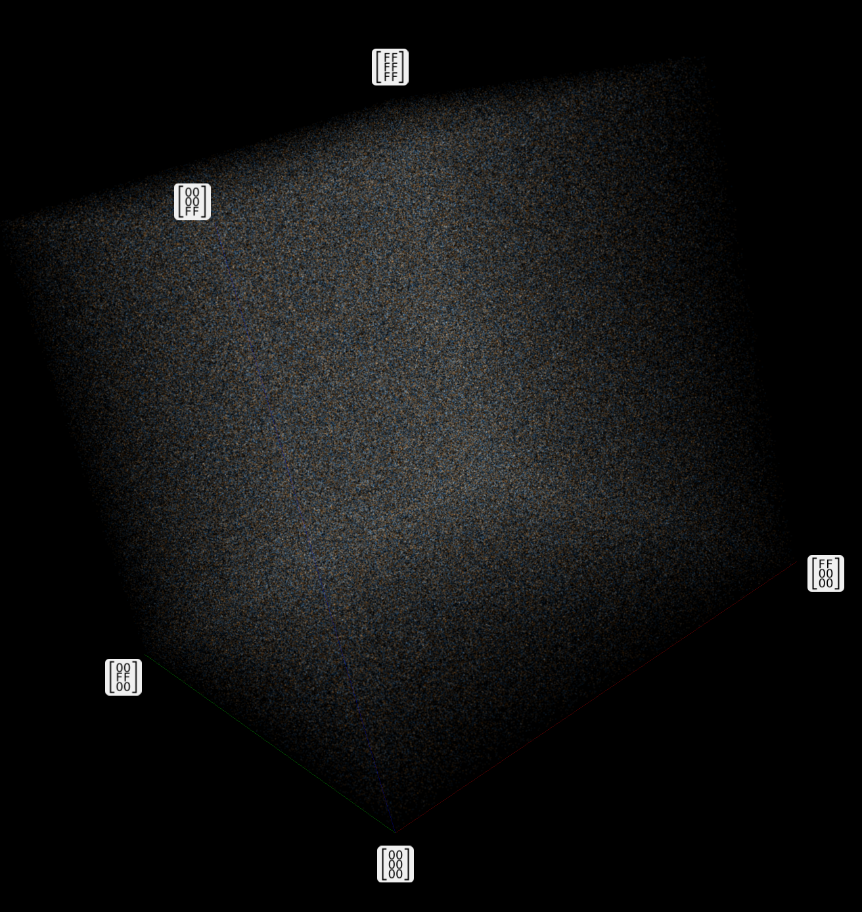
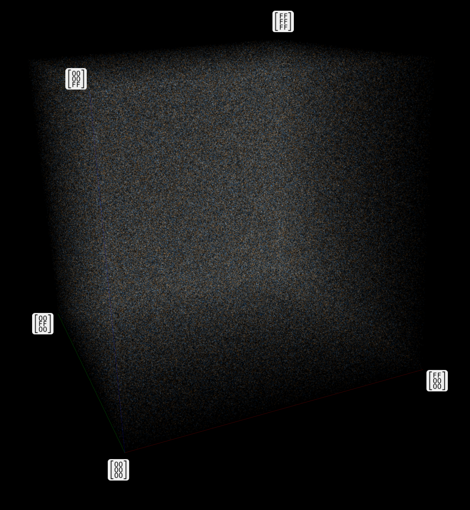
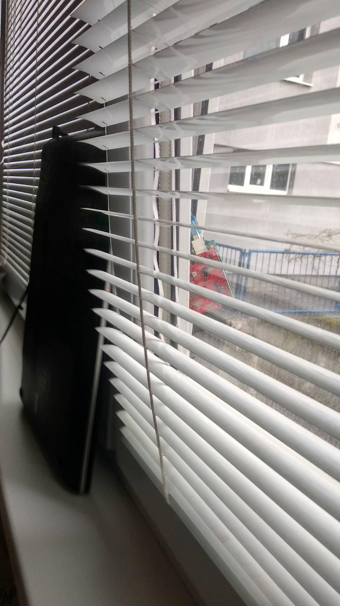
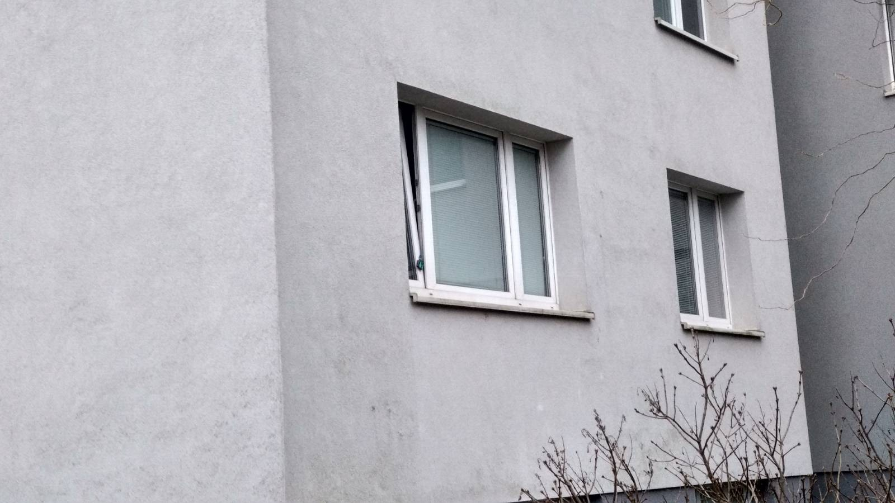

# tehagenaci: ročníkový projekt
* [tehagenaci: ročníkový projekt](#tehagenaci-ročníkový-projekt)
   * [O projekte](#o-projekte)
      * [Študent](#študent)
      * [Školiaci](#školiaci)
      * [Cieľe projektu](#cieľe-projektu)
   * [Výsledky projektu [2023, január]](#výsledky-projektu-2023-január)
      * [Hardvér](#hardvér)
      * [Softvér](#softvér)
      * [Testované prostredia](#testované-prostredia)
      * [Prostredia](#prostredia)
      * [Výsledky](#výsledky)
      * [Veles](#veles)
      * [Appendix - ako sme generovali vzorku pre test 'Znížená teplota'](#appendix---ako-sme-generovali-vzorku-pre-test-‘znížená-teplota’)
      * [Záver](#záver)
         * [Možno si všimnúť](#možno-si-všimnúť)
      * [Čo ďalej](#čo-ďalej)

## O projekte
**Názov**: Testovanie hardvérových generátorov náhodných čísiel

### Študent
**Meno**: Anton Kica

**Email**: kica6@uniba.sk

### Školiaci
**Meno**: RNDr. Richard Ostertág, PhD.

**Email**: ostertag@dcs.fmph.uniba.sk

### Cieľe projektu

1. Vyvinúť alebo nájsť vhodné existujúce aplikácie pre testovanie kvality náhodných generátorov

2. Získať náhodné dáta zo zvolených HW generátorov za rôznych podmienok, otestovať kvalitu súčiastok a pozorovať prípadné zmeny parametrov

## Výsledky projektu [2023, január]

Podarilo sa nám vyzbierať a spracovať dáta generované hardvérovými súčiastkami.

### Hardvér
- [Ardunino UNO SMD rev. 3x](https://store.arduino.cc/products/arduino-uno-rev3)
- [SparkFun CryptoShield](https://www.sparkfun.com/products/retired/13183)
  - využili sme jeho súčiastku [ATECC108](http://ww1.microchip.com/downloads/en/DeviceDoc/Atmel-8873S-CryptoAuth-ATECC108-Datasheet-Summary.pdf)

### Softvér
- [Dieharder](https://webhome.phy.duke.edu/~rgb/General/dieharder.php)
  - testovanie spoľahlivosti náhodných generátorov a postupností
- [cryptoauth-arduino](https://github.com/cryptotronix/cryptoauth-arduino)
  - knižnica na komunikáciu s ATECC108
- [Veles](https://codisec.com/veles)
  - nástroj na analýzu binárnych dát

### Testované prostredia
Hardvérovú súčiastku sme testovali v rôznych podmienkach.

### Prostredia
|prostredie|teplota|veľkosť vzorky v MB|dĺžka generovania v minútach|
|-|-|-|-|
| Izbová teplota|21° (izbová)|231|1366|
|Znížená teplota|0°|257|2218|

### Výsledky
#### Dieharder 
Testy, v ktorých je signifikantnejší rozdilel p-hodnôt sú označené *
  * [dieharder_birthdays *](#dieharder_birthdays-*)
  * [dieharder_operm5 *](#dieharder_operm5-*)
  * [dieharder_rank_32x32 *](#dieharder_rank_32x32-*)
  * [dieharder_rank_6x8](#dieharder_rank_6x8)
  * [dieharder_bitstream *](#dieharder_bitstream-*)
  * [dieharder_opso *](#dieharder_opso-*)
  * [dieharder_oqso *](#dieharder_oqso-*)
  * [dieharder_dna *](#dieharder_dna-*)
  * [dieharder_count_1s_str *](#dieharder_count_1s_str-*)
  * [dieharder_count_1s_byt *](#dieharder_count_1s_byt-*)
  * [dieharder_parking_lot *](#dieharder_parking_lot-*)
  * [dieharder_2dsphere *](#dieharder_2dsphere-*)
  * [dieharder_3dsphere *](#dieharder_3dsphere-*)
  * [dieharder_squeeze *](#dieharder_squeeze-*)
  * [dieharder_sums *](#dieharder_sums-*)
  * [dieharder_runs *](#dieharder_runs-*)
  * [dieharder_runs *](#dieharder_runs-*-1)
  * [dieharder_craps *](#dieharder_craps-*)
  * [dieharder_craps *](#dieharder_craps-*-1)
  * [marsaglia_tsang_gcd *](#marsaglia_tsang_gcd-*)
  * [marsaglia_tsang_gcd *](#marsaglia_tsang_gcd-*-1)
  * [sts_monobit *](#sts_monobit-*)
  * [sts_runs](#sts_runs)
  * [sts_serial *](#sts_serial-*)
  * [sts_serial *](#sts_serial-*-1)
  * [sts_serial *](#sts_serial-*-2)
  * [sts_serial *](#sts_serial-*-3)
  * [sts_serial](#sts_serial)
  * [sts_serial *](#sts_serial-*-4)
  * [sts_serial *](#sts_serial-*-5)
  * [sts_serial](#sts_serial-1)
  * [sts_serial *](#sts_serial-*-6)
  * [sts_serial](#sts_serial-2)
  * [sts_serial](#sts_serial-3)
  * [sts_serial *](#sts_serial-*-7)
  * [sts_serial *](#sts_serial-*-8)
  * [sts_serial](#sts_serial-4)
  * [sts_serial *](#sts_serial-*-9)
  * [sts_serial](#sts_serial-5)
  * [sts_serial](#sts_serial-6)
  * [sts_serial](#sts_serial-7)
  * [sts_serial](#sts_serial-8)
  * [sts_serial *](#sts_serial-*-10)
  * [sts_serial *](#sts_serial-*-11)
  * [sts_serial *](#sts_serial-*-12)
  * [sts_serial *](#sts_serial-*-13)
  * [sts_serial *](#sts_serial-*-14)
  * [sts_serial *](#sts_serial-*-15)
  * [sts_serial *](#sts_serial-*-16)
  * [sts_serial *](#sts_serial-*-17)
  * [sts_serial *](#sts_serial-*-18)
  * [sts_serial *](#sts_serial-*-19)
  * [sts_serial *](#sts_serial-*-20)
  * [rgb_bitdist *](#rgb_bitdist-*)
  * [rgb_bitdist *](#rgb_bitdist-*-1)
  * [rgb_bitdist *](#rgb_bitdist-*-2)
  * [rgb_bitdist *](#rgb_bitdist-*-3)
  * [rgb_bitdist *](#rgb_bitdist-*-4)
  * [rgb_bitdist *](#rgb_bitdist-*-5)
  * [rgb_bitdist *](#rgb_bitdist-*-6)
  * [rgb_bitdist](#rgb_bitdist)
  * [rgb_bitdist](#rgb_bitdist-1)
  * [rgb_bitdist *](#rgb_bitdist-*-7)
  * [rgb_bitdist *](#rgb_bitdist-*-8)
  * [rgb_bitdist *](#rgb_bitdist-*-9)
  * [rgb_minimum_distance *](#rgb_minimum_distance-*)
  * [rgb_minimum_distance *](#rgb_minimum_distance-*-1)
  * [rgb_minimum_distance *](#rgb_minimum_distance-*-2)
  * [rgb_minimum_distance *](#rgb_minimum_distance-*-3)
  * [rgb_permutations *](#rgb_permutations-*)
  * [rgb_permutations *](#rgb_permutations-*-1)
  * [rgb_permutations *](#rgb_permutations-*-2)
  * [rgb_permutations](#rgb_permutations)
  * [rgb_lagged_sum](#rgb_lagged_sum)
  * [rgb_lagged_sum *](#rgb_lagged_sum-*)
  * [rgb_lagged_sum *](#rgb_lagged_sum-*-1)
  * [rgb_lagged_sum *](#rgb_lagged_sum-*-2)
  * [rgb_lagged_sum](#rgb_lagged_sum-1)
  * [rgb_lagged_sum *](#rgb_lagged_sum-*-3)
  * [rgb_lagged_sum *](#rgb_lagged_sum-*-4)
  * [rgb_lagged_sum *](#rgb_lagged_sum-*-5)
  * [rgb_lagged_sum *](#rgb_lagged_sum-*-6)
  * [rgb_lagged_sum *](#rgb_lagged_sum-*-7)
  * [rgb_lagged_sum *](#rgb_lagged_sum-*-8)
  * [rgb_lagged_sum *](#rgb_lagged_sum-*-9)
  * [rgb_lagged_sum *](#rgb_lagged_sum-*-10)
  * [rgb_lagged_sum *](#rgb_lagged_sum-*-11)
  * [rgb_lagged_sum *](#rgb_lagged_sum-*-12)
  * [rgb_lagged_sum *](#rgb_lagged_sum-*-13)
  * [rgb_lagged_sum *](#rgb_lagged_sum-*-14)
  * [rgb_lagged_sum *](#rgb_lagged_sum-*-15)
  * [rgb_lagged_sum *](#rgb_lagged_sum-*-16)
  * [rgb_lagged_sum *](#rgb_lagged_sum-*-17)
  * [rgb_lagged_sum *](#rgb_lagged_sum-*-18)
  * [rgb_lagged_sum *](#rgb_lagged_sum-*-19)
  * [rgb_lagged_sum *](#rgb_lagged_sum-*-20)
  * [rgb_lagged_sum *](#rgb_lagged_sum-*-21)
  * [rgb_lagged_sum *](#rgb_lagged_sum-*-22)
  * [rgb_lagged_sum *](#rgb_lagged_sum-*-23)
  * [rgb_lagged_sum *](#rgb_lagged_sum-*-24)
  * [rgb_lagged_sum *](#rgb_lagged_sum-*-25)
  * [rgb_lagged_sum *](#rgb_lagged_sum-*-26)
  * [rgb_lagged_sum *](#rgb_lagged_sum-*-27)
  * [rgb_lagged_sum *](#rgb_lagged_sum-*-28)
  * [rgb_lagged_sum *](#rgb_lagged_sum-*-29)
  * [rgb_lagged_sum *](#rgb_lagged_sum-*-30)
  * [rgb_kstest_test](#rgb_kstest_test)
  * [dab_bytedistrib *](#dab_bytedistrib-*)
  * [dab_dct](#dab_dct)
  * [dab_filltree *](#dab_filltree-*)
  * [dab_filltree](#dab_filltree)
  * [dab_filltree2 *](#dab_filltree2-*)
  * [dab_filltree2 *](#dab_filltree2-*-1)
  * [dab_monobit2 *](#dab_monobit2-*)

#### dieharder_birthdays *
| prostredie|ntup| tsamples |psamples|  p-value |Assessment|
|-|-|-|-|-|-|
| Izbová teplota|   0|       100|     100|0.50319350|  PASSED  |
| 25°C   |   0|       100|     100|0.63349194|  PASSED  |
| 40°C|   0|       100|     100|0.62697800|  PASSED  |
|Znížená teplota|   0|       100|     100|0.23579804|  PASSED  |
#### dieharder_operm5 *
| prostredie|ntup| tsamples |psamples|  p-value |Assessment|
|-|-|-|-|-|-|
| Izbová teplota|   0|   1000000|     100|0.43174119|  PASSED  |
| 25°C   |   0|   1000000|     100|0.37030165|  PASSED  |
| 40°C|   0|   1000000|     100|0.43915473|  PASSED  |
|Znížená teplota|   0|   1000000|     100|0.72447632|  PASSED  |
#### dieharder_rank_32x32 *
| prostredie|ntup| tsamples |psamples|  p-value |Assessment|
|-|-|-|-|-|-|
| Izbová teplota|   0|     40000|     100|0.44019941|  PASSED  |
| 25°C   |   0|     40000|     100|0.91807571|  PASSED  |
| 40°C|   0|     40000|     100|0.16247614|  PASSED  |
|Znížená teplota|   0|     40000|     100|0.63749501|  PASSED  |
#### dieharder_rank_6x8
| prostredie|ntup| tsamples |psamples|  p-value |Assessment|
|-|-|-|-|-|-|
| Izbová teplota|   0|    100000|     100|0.54024721|  PASSED  |
| 25°C   |   0|    100000|     100|0.95071500|  PASSED  |
| 40°C|   0|    100000|     100|0.70254636|  PASSED  |
|Znížená teplota|   0|    100000|     100|0.49559319|  PASSED  |
#### dieharder_bitstream *
| prostredie|ntup| tsamples |psamples|  p-value |Assessment|
|-|-|-|-|-|-|
| Izbová teplota|   0|   2097152|     100|0.34949261|  PASSED  |
| 25°C   |   0|   2097152|     100|0.56058176|  PASSED  |
| 40°C|   0|   2097152|     100|0.28032227|  PASSED  |
|Znížená teplota|   0|   2097152|     100|0.69916295|  PASSED  |
#### dieharder_opso *
| prostredie|ntup| tsamples |psamples|  p-value |Assessment|
|-|-|-|-|-|-|
| Izbová teplota|   0|   2097152|     100|0.06777356|  PASSED  |
| 25°C   |   0|   2097152|     100|0.90431329|  PASSED  |
| 40°C|   0|   2097152|     100|0.63379470|  PASSED  |
|Znížená teplota|   0|   2097152|     100|0.00118623|   WEAK   |
#### dieharder_oqso *
| prostredie|ntup| tsamples |psamples|  p-value |Assessment|
|-|-|-|-|-|-|
| Izbová teplota|   0|   2097152|     100|0.72449996|  PASSED  |
| 25°C   |   0|   2097152|     100|0.41725711|  PASSED  |
| 40°C|   0|   2097152|     100|0.87257694|  PASSED  |
|Znížená teplota|   0|   2097152|     100|0.93447054|  PASSED  |
#### dieharder_dna *
| prostredie|ntup| tsamples |psamples|  p-value |Assessment|
|-|-|-|-|-|-|
| Izbová teplota|   0|   2097152|     100|0.39048633|  PASSED  |
| 25°C   |   0|   2097152|     100|0.89664808|  PASSED  |
| 40°C|   0|   2097152|     100|0.62647386|  PASSED  |
|Znížená teplota|   0|   2097152|     100|0.92712657|  PASSED  |
#### dieharder_count_1s_str *
| prostredie|ntup| tsamples |psamples|  p-value |Assessment|
|-|-|-|-|-|-|
| Izbová teplota|   0|    256000|     100|0.23833845|  PASSED  |
| 25°C   |0|    256000|     100|0.31090440|  PASSED  |
| 40°C|   0|    256000|     100|0.65572900|  PASSED  |
|Znížená teplota|   0|    256000|     100|0.41756806|  PASSED  |
#### dieharder_count_1s_byt *
| prostredie|ntup| tsamples |psamples|  p-value |Assessment|
|-|-|-|-|-|-|
| Izbová teplota|   0|    256000|     100|0.41704546|  PASSED  |
| 25°C   |0|    256000|     100|0.82183232|  PASSED  |
| 40°C|   0|    256000|     100|0.73205060|  PASSED  |
|Znížená teplota|   0|    256000|     100|0.76896458|  PASSED  |
#### dieharder_parking_lot *
| prostredie|ntup| tsamples |psamples|  p-value |Assessment|
|-|-|-|-|-|-|
| Izbová teplota|   0|     12000|     100|0.90999882|  PASSED  |
| 25°C   |   0|     12000|     100|0.13974174|  PASSED  |
| 40°C|   0|     12000|     100|0.65655550|  PASSED  |
|Znížená teplota|   0|     12000|     100|0.66912419|  PASSED  |
#### dieharder_2dsphere *
| prostredie|ntup| tsamples |psamples|  p-value |Assessment|
|-|-|-|-|-|-|
| Izbová teplota|   2|      8000|     100|0.12220458|  PASSED  |
| 25°C   |   2|      8000|     100|0.61389852|  PASSED  |
| 40°C|   2|      8000|     100|0.81291402|  PASSED  |
|Znížená teplota|   2|      8000|     100|0.54327847|  PASSED  |
#### dieharder_3dsphere *
| prostredie|ntup| tsamples |psamples|  p-value |Assessment|
|-|-|-|-|-|-|
| Izbová teplota|   3|      4000|     100|0.27432417|  PASSED  |
| 25°C   |   3|      4000|     100|0.87201452|  PASSED  |
| 40°C|   3|      4000|     100|0.86081978|  PASSED  |
|Znížená teplota|   3|      4000|     100|0.99232513|  PASSED  |
#### dieharder_squeeze *
| prostredie|ntup| tsamples |psamples|  p-value |Assessment|
|-|-|-|-|-|-|
| Izbová teplota|   0|    100000|     100|0.46640643|  PASSED  |
| 25°C   |   0|    100000|     100|0.61210698|  PASSED  |
| 40°C|   0|    100000|     100|0.07150114|  PASSED  |
|Znížená teplota|   0|    100000|     100|0.11447009|  PASSED  |
#### dieharder_sums *
| prostredie|ntup| tsamples |psamples|  p-value |Assessment|
|-|-|-|-|-|-|
| Izbová teplota|   0|       100|     100|0.00123076|   WEAK   |
| 25°C   |   0|       100|     100|0.00848824|  PASSED  |
| 40°C|   0|       100|     100|0.02395160|  PASSED  |
|Znížená teplota|   0|       100|     100|0.66218623|  PASSED  |
#### dieharder_runs *
| prostredie|ntup| tsamples |psamples|  p-value |Assessment|
|-|-|-|-|-|-|
| Izbová teplota|   0|    100000|     100|0.24583178|  PASSED  |
| 25°C   |   0|    100000|     100|0.17644771|  PASSED  |
| 40°C|   0|    100000|     100|0.56361319|  PASSED  |
|Znížená teplota|   0|    100000|     100|0.53958809|  PASSED  |
#### dieharder_runs *
| prostredie|ntup| tsamples |psamples|  p-value |Assessment|
|-|-|-|-|-|-|
| Izbová teplota|   0|    100000|     100|0.37085418|  PASSED  |
| 25°C   |   0|    100000|     100|0.98619218|  PASSED  |
| 40°C|   0|    100000|     100|0.57176099|  PASSED  |
|Znížená teplota|   0|    100000|     100|0.98044129|  PASSED  |
#### dieharder_craps *
| prostredie|ntup| tsamples |psamples|  p-value |Assessment|
|-|-|-|-|-|-|
| Izbová teplota|   0|    200000|     100|0.21917504|  PASSED  |
| 25°C   |   0|    200000|     100|0.00030243|   WEAK   |
| 40°C|   0|    200000|     100|0.10021755|  PASSED  |
|Znížená teplota|   0|    200000|     100|0.52482089|  PASSED  |
#### dieharder_craps *
| prostredie|ntup| tsamples |psamples|  p-value |Assessment|
|-|-|-|-|-|-|
| Izbová teplota|   0|    200000|     100|0.49780118|  PASSED  |
| 25°C   |   0|    200000|     100|0.58823032|  PASSED  |
| 40°C|   0|    200000|     100|0.51659543|  PASSED  |
|Znížená teplota|   0|    200000|     100|0.23596044|  PASSED  |
#### marsaglia_tsang_gcd *
| prostredie|ntup| tsamples |psamples|  p-value |Assessment|
|-|-|-|-|-|-|
| Izbová teplota|   0|  10000000|     100|0.00001491|   WEAK   |
| 25°C   |   0|  10000000|     100|0.10623656|  PASSED  |
| 40°C|   0|  10000000|     100|0.35206628|  PASSED  |
|Znížená teplota|   0|  10000000|     100|0.00083062|   WEAK   |
#### marsaglia_tsang_gcd *
| prostredie|ntup| tsamples |psamples|  p-value |Assessment|
|-|-|-|-|-|-|
| Izbová teplota|   0|  10000000|     100|0.00472095|   WEAK   |
| 25°C   |   0|  10000000|     100|0.00855429|  PASSED  |
| 40°C|   0|  10000000|     100|0.00007518|   WEAK   |
|Znížená teplota|   0|  10000000|     100|0.00004898|   WEAK   |
#### sts_monobit *
| prostredie|ntup| tsamples |psamples|  p-value |Assessment|
|-|-|-|-|-|-|
| Izbová teplota|   1|    100000|     100|0.90949020|  PASSED  |
| 25°C   |   1|    100000|     100|0.56210100|  PASSED  |
| 40°C|   1|    100000|     100|0.18509551|  PASSED  |
|Znížená teplota|   1|    100000|     100|0.61300866|  PASSED  |
#### sts_runs
| prostredie|ntup| tsamples |psamples|  p-value |Assessment|
|-|-|-|-|-|-|
| Izbová teplota|   2|    100000|     100|0.33235740|  PASSED  |
| 25°C   |   2|    100000|     100|0.27696380|  PASSED  |
| 40°C|   2|    100000|     100|0.02272815|  PASSED  |
|Znížená teplota|   2|    100000|     100|0.25744567|  PASSED  |
#### sts_serial *
| prostredie|ntup| tsamples |psamples|  p-value |Assessment|
|-|-|-|-|-|-|
| Izbová teplota|   1|    100000|     100|0.10819493|  PASSED  |
| 25°C   |   1|    100000|     100|0.91461725|  PASSED  |
| 40°C|   1|    100000|     100|0.33555836|  PASSED  |
|Znížená teplota|   1|    100000|     100|0.79556208|  PASSED  |
#### sts_serial *
| prostredie|ntup| tsamples |psamples|  p-value |Assessment|
|-|-|-|-|-|-|
| Izbová teplota|   2|    100000|     100|0.97737185|  PASSED  |
| 25°C   |   2|    100000|     100|0.11863887|  PASSED  |
| 40°C|   2|    100000|     100|0.99999993|  FAILED  |
|Znížená teplota|   2|    100000|     100|0.10043132|  PASSED  |
#### sts_serial *
| prostredie|ntup| tsamples |psamples|  p-value |Assessment|
|-|-|-|-|-|-|
| Izbová teplota|   3|    100000|     100|0.45888116|  PASSED  |
| 25°C   |   3|    100000|     100|0.68977784|  PASSED  |
| 40°C|   3|    100000|     100|0.40114111|  PASSED  |
|Znížená teplota|   3|    100000|     100|0.08027417|  PASSED  |
#### sts_serial *
| prostredie|ntup| tsamples |psamples|  p-value |Assessment|
|-|-|-|-|-|-|
| Izbová teplota|   3|    100000|     100|0.77785332|  PASSED  |
| 25°C   |   3|    100000|     100|0.91712075|  PASSED  |
| 40°C|   3|    100000|     100|0.59631759|  PASSED  |
|Znížená teplota|   3|    100000|     100|0.52394096|  PASSED  |
#### sts_serial
| prostredie|ntup| tsamples |psamples|  p-value |Assessment|
|-|-|-|-|-|-|
| Izbová teplota|   4|    100000|     100|0.32035633|  PASSED  |
| 25°C   |   4|    100000|     100|0.27199588|  PASSED  |
| 40°C|   4|    100000|     100|0.67070304|  PASSED  |
|Znížená teplota|   4|    100000|     100|0.23742126|  PASSED  |
#### sts_serial *
| prostredie|ntup| tsamples |psamples|  p-value |Assessment|
|-|-|-|-|-|-|
| Izbová teplota|   4|    100000|     100|0.79209362|  PASSED  |
| 25°C   |   4|    100000|     100|0.42747093|  PASSED  |
| 40°C|   4|    100000|     100|0.66726588|  PASSED  |
|Znížená teplota|   4|    100000|     100|0.47231625|  PASSED  |
#### sts_serial *
| prostredie|ntup| tsamples |psamples|  p-value |Assessment|
|-|-|-|-|-|-|
| Izbová teplota|   5|    100000|     100|0.87168072|  PASSED  |
| 25°C   |   5|    100000|     100|0.33196070|  PASSED  |
| 40°C|   5|    100000|     100|0.76637275|  PASSED  |
|Znížená teplota|   5|    100000|     100|0.11460566|  PASSED  |
#### sts_serial
| prostredie|ntup| tsamples |psamples|  p-value |Assessment|
|-|-|-|-|-|-|
| Izbová teplota|   5|    100000|     100|0.98188624|  PASSED  |
| 25°C   |   5|    100000|     100|0.76366373|  PASSED  |
| 40°C|   5|    100000|     100|0.93304336|  PASSED  |
|Znížená teplota|   5|    100000|     100|0.95764821|  PASSED  |
#### sts_serial *
| prostredie|ntup| tsamples |psamples|  p-value |Assessment|
|-|-|-|-|-|-|
| Izbová teplota|   6|    100000|     100|0.45268710|  PASSED  |
| 25°C   |   6|    100000|     100|0.24713529|  PASSED  |
| 40°C|   6|    100000|     100|0.48953563|  PASSED  |
|Znížená teplota|   6|    100000|     100|0.67359373|  PASSED  |
#### sts_serial
| prostredie|ntup| tsamples |psamples|  p-value |Assessment|
|-|-|-|-|-|-|
| Izbová teplota|   6|    100000|     100|0.93630415|  PASSED  |
| 25°C   |   6|    100000|     100|0.88690360|  PASSED  |
| 40°C|   6|    100000|     100|0.37628169|  PASSED  |
|Znížená teplota|   6|    100000|     100|0.89783092|  PASSED  |
#### sts_serial
| prostredie|ntup| tsamples |psamples|  p-value |Assessment|
|-|-|-|-|-|-|
| Izbová teplota|   7|    100000|     100|0.81884397|  PASSED  |
| 25°C   |   7|    100000|     100|0.88379481|  PASSED  |
| 40°C|   7|    100000|     100|0.15011584|  PASSED  |
|Znížená teplota|   7|    100000|     100|0.96859166|  PASSED  |
#### sts_serial *
| prostredie|ntup| tsamples |psamples|  p-value |Assessment|
|-|-|-|-|-|-|
| Izbová teplota|   7|    100000|     100|0.13293360|  PASSED  |
| 25°C   |   7|    100000|     100|0.71288124|  PASSED  |
| 40°C|   7|    100000|     100|0.14421943|  PASSED  |
|Znížená teplota|   7|    100000|     100|0.37487508|  PASSED  |
#### sts_serial *
| prostredie|ntup| tsamples |psamples|  p-value |Assessment|
|-|-|-|-|-|-|
| Izbová teplota|   8|    100000|     100|0.36663128|  PASSED  |
| 25°C   |   8|    100000|     100|0.15214960|  PASSED  |
| 40°C|   8|    100000|     100|0.06279317|  PASSED  |
|Znížená teplota|   8|    100000|     100|0.92267267|  PASSED  |
#### sts_serial
| prostredie|ntup| tsamples |psamples|  p-value |Assessment|
|-|-|-|-|-|-|
| Izbová teplota|   8|    100000|     100|0.87070459|  PASSED  |
| 25°C   |   8|    100000|     100|0.25709665|  PASSED  |
| 40°C|   8|    100000|     100|0.24406923|  PASSED  |
|Znížená teplota|   8|    100000|     100|0.88158842|  PASSED  |
#### sts_serial *
| prostredie|ntup| tsamples |psamples|  p-value |Assessment|
|-|-|-|-|-|-|
| Izbová teplota|   9|    100000|     100|0.42213009|  PASSED  |
| 25°C   |   9|    100000|     100|0.32006580|  PASSED  |
| 40°C|   9|    100000|     100|0.30249082|  PASSED  |
|Znížená teplota|   9|    100000|     100|0.66102014|  PASSED  |
#### sts_serial
| prostredie|ntup| tsamples |psamples|  p-value |Assessment|
|-|-|-|-|-|-|
| Izbová teplota|   9|    100000|     100|0.37646597|  PASSED  |
| 25°C   |   9|    100000|     100|0.91031841|  PASSED  |
| 40°C|   9|    100000|     100|0.92754752|  PASSED  |
|Znížená teplota|   9|    100000|     100|0.27198463|  PASSED  |
#### sts_serial
| prostredie|ntup| tsamples |psamples|  p-value |Assessment|
|-|-|-|-|-|-|
| Izbová teplota|  10|    100000|     100|0.25142432|  PASSED  |
| 25°C   |  10|    100000|     100|0.05501587|  PASSED  |
| 40°C|  10|    100000|     100|0.04929238|  PASSED  |
|Znížená teplota|  10|    100000|     100|0.14320257|  PASSED  |
#### sts_serial
| prostredie|ntup| tsamples |psamples|  p-value |Assessment|
|-|-|-|-|-|-|
| Izbová teplota|  10|    100000|     100|0.63646224|  PASSED  |
| 25°C   |  10|    100000|     100|0.03753409|  PASSED  |
| 40°C|  10|    100000|     100|0.01130824|  PASSED  |
|Znížená teplota|  10|    100000|     100|0.46252560|  PASSED  |
#### sts_serial
| prostredie|ntup| tsamples |psamples|  p-value |Assessment|
|-|-|-|-|-|-|
| Izbová teplota|  11|    100000|     100|0.63755392|  PASSED  |
| 25°C   |  11|    100000|     100|0.11251993|  PASSED  |
| 40°C|  11|    100000|     100|0.03696331|  PASSED  |
|Znížená teplota|  11|    100000|     100|0.50676899|  PASSED  |
#### sts_serial *
| prostredie|ntup| tsamples |psamples|  p-value |Assessment|
|-|-|-|-|-|-|
| Izbová teplota|  11|    100000|     100|0.76117433|  PASSED  |
| 25°C   |  11|    100000|     100|0.26768336|  PASSED  |
| 40°C|  11|    100000|     100|0.31314271|  PASSED  |
|Znížená teplota|  11|    100000|     100|0.99258222|  PASSED  |
#### sts_serial *
| prostredie|ntup| tsamples |psamples|  p-value |Assessment|
|-|-|-|-|-|-|
| Izbová teplota|  12|    100000|     100|0.72055265|  PASSED  |
| 25°C   |  12|    100000|     100|0.11029400|  PASSED  |
| 40°C|  12|    100000|     100|0.34245137|  PASSED  |
|Znížená teplota|  12|    100000|     100|0.88513473|  PASSED  |
#### sts_serial *
| prostredie|ntup| tsamples |psamples|  p-value |Assessment|
|-|-|-|-|-|-|
| Izbová teplota|  12|    100000|     100|0.93150182|  PASSED  |
| 25°C   |  12|    100000|     100|0.79069075|  PASSED  |
| 40°C|  12|    100000|     100|0.95088097|  PASSED  |
|Znížená teplota|  12|    100000|     100|0.68219334|  PASSED  |
#### sts_serial *
| prostredie|ntup| tsamples |psamples|  p-value |Assessment|
|-|-|-|-|-|-|
| Izbová teplota|  13|    100000|     100|0.97593963|  PASSED  |
| 25°C   |  13|    100000|     100|0.00599536|  PASSED  |
| 40°C|  13|    100000|     100|0.97391854|  PASSED  |
|Znížená teplota|  13|    100000|     100|0.79215678|  PASSED  |
#### sts_serial *
| prostredie|ntup| tsamples |psamples|  p-value |Assessment|
|-|-|-|-|-|-|
| Izbová teplota|  13|    100000|     100|0.98227105|  PASSED  |
| 25°C   |  13|    100000|     100|0.13762201|  PASSED  |
| 40°C|  13|    100000|     100|0.92173551|  PASSED  |
|Znížená teplota|  13|    100000|     100|0.31384592|  PASSED  |
#### sts_serial *
| prostredie|ntup| tsamples |psamples|  p-value |Assessment|
|-|-|-|-|-|-|
| Izbová teplota|  14|    100000|     100|0.37510183|  PASSED  |
| 25°C   |  14|    100000|     100|0.07634252|  PASSED  |
| 40°C|  14|    100000|     100|0.94526643|  PASSED  |
|Znížená teplota|  14|    100000|     100|0.06038477|  PASSED  |
#### sts_serial *
| prostredie|ntup| tsamples |psamples|  p-value |Assessment|
|-|-|-|-|-|-|
| Izbová teplota|  14|    100000|     100|0.60857057|  PASSED  |
| 25°C   |  14|    100000|     100|0.88938452|  PASSED  |
| 40°C|  14|    100000|     100|0.96766557|  PASSED  |
|Znížená teplota|  14|    100000|     100|0.79321311|  PASSED  |
#### sts_serial *
| prostredie|ntup| tsamples |psamples|  p-value |Assessment|
|-|-|-|-|-|-|
| Izbová teplota|  15|    100000|     100|0.88061603|  PASSED  |
| 25°C   |  15|    100000|     100|0.99149543|  PASSED  |
| 40°C|  15|    100000|     100|0.97174905|  PASSED  |
|Znížená teplota|  15|    100000|     100|0.50158160|  PASSED  |
#### sts_serial *
| prostredie|ntup| tsamples |psamples|  p-value |Assessment|
|-|-|-|-|-|-|
| Izbová teplota|  15|    100000|     100|0.67567252|  PASSED  |
| 25°C   |  15|    100000|     100|0.33872791|  PASSED  |
| 40°C|  15|    100000|     100|0.93499137|  PASSED  |
|Znížená teplota|  15|    100000|     100|0.47596553|  PASSED  |
#### sts_serial *
| prostredie|ntup| tsamples |psamples|  p-value |Assessment|
|-|-|-|-|-|-|
| Izbová teplota|  16|    100000|     100|0.92826026|  PASSED  |
| 25°C   |  16|    100000|     100|0.69737253|  PASSED  |
| 40°C|  16|    100000|     100|0.47265806|  PASSED  |
|Znížená teplota|  16|    100000|     100|0.03221822|  PASSED  |
#### sts_serial *
| prostredie|ntup| tsamples |psamples|  p-value |Assessment|
|-|-|-|-|-|-|
| Izbová teplota|  16|    100000|     100|0.58187349|  PASSED  |
| 25°C   |  16|    100000|     100|0.98956126|  PASSED  |
| 40°C|  16|    100000|     100|0.86235328|  PASSED  |
|Znížená teplota|  16|    100000|     100|0.88451065|  PASSED  |
#### rgb_bitdist *
| prostredie|ntup| tsamples |psamples|  p-value |Assessment|
|-|-|-|-|-|-|
| Izbová teplota|   1|    100000|     100|0.70921138|  PASSED  |
| 25°C   |   1|    100000|     100|0.06334761|  PASSED  |
| 40°C|   1|    100000|     100|0.55613573|  PASSED  |
|Znížená teplota|   1|    100000|     100|0.16150813|  PASSED  |
#### rgb_bitdist *
| prostredie|ntup| tsamples |psamples|  p-value |Assessment|
|-|-|-|-|-|-|
| Izbová teplota|   2|    100000|     100|0.12472575|  PASSED  |
| 25°C   |   2|    100000|     100|0.86644069|  PASSED  |
| 40°C|   2|    100000|     100|0.97193452|  PASSED  |
|Znížená teplota|   2|    100000|     100|0.53871954|  PASSED  |
#### rgb_bitdist *
| prostredie|ntup| tsamples |psamples|  p-value |Assessment|
|-|-|-|-|-|-|
| Izbová teplota|   3|    100000|     100|0.96329872|  PASSED  |
| 25°C   |   3|    100000|     100|0.84025850|  PASSED  |
| 40°C|   3|    100000|     100|0.88503400|  PASSED  |
|Znížená teplota|   3|    100000|     100|0.64615246|  PASSED  |
#### rgb_bitdist *
| prostredie|ntup| tsamples |psamples|  p-value |Assessment|
|-|-|-|-|-|-|
| Izbová teplota|   4|    100000|     100|0.31258394|  PASSED  |
| 25°C   |   4|    100000|     100|0.58940513|  PASSED  |
| 40°C|   4|    100000|     100|0.79448642|  PASSED  |
|Znížená teplota|   4|    100000|     100|0.60509157|  PASSED  |
#### rgb_bitdist *
| prostredie|ntup| tsamples |psamples|  p-value |Assessment|
|-|-|-|-|-|-|
| Izbová teplota|   5|    100000|     100|0.32163706|  PASSED  |
| 25°C   |   5|    100000|     100|0.23164016|  PASSED  |
| 40°C|   5|    100000|     100|0.27044463|  PASSED  |
|Znížená teplota|   5|    100000|     100|0.67125581|  PASSED  |
#### rgb_bitdist *
| prostredie|ntup| tsamples |psamples|  p-value |Assessment|
|-|-|-|-|-|-|
| Izbová teplota|   6|    100000|     100|0.88686463|  PASSED  |
| 25°C   |   6|    100000|     100|0.88047154|  PASSED  |
| 40°C|   6|    100000|     100|0.63950370|  PASSED  |
|Znížená teplota|   6|    100000|     100|0.02956216|  PASSED  |
#### rgb_bitdist *
| prostredie|ntup| tsamples |psamples|  p-value |Assessment|
|-|-|-|-|-|-|
| Izbová teplota|   7|    100000|     100|0.20748346|  PASSED  |
| 25°C   |   7|    100000|     100|0.45910559|  PASSED  |
| 40°C|   7|    100000|     100|0.72062420|  PASSED  |
|Znížená teplota|   7|    100000|     100|0.99384808|  PASSED  |
#### rgb_bitdist
| prostredie|ntup| tsamples |psamples|  p-value |Assessment|
|-|-|-|-|-|-|
| Izbová teplota|   8|    100000|     100|0.60506925|  PASSED  |
| 25°C   |   8|    100000|     100|0.60755156|  PASSED  |
| 40°C|   8|    100000|     100|0.72134414|  PASSED  |
|Znížená teplota|   8|    100000|     100|0.77333974|  PASSED  |
#### rgb_bitdist
| prostredie|ntup| tsamples |psamples|  p-value |Assessment|
|-|-|-|-|-|-|
| Izbová teplota|   9|    100000|     100|0.78415059|  PASSED  |
| 25°C   |   9|    100000|     100|0.59834610|  PASSED  |
| 40°C|   9|    100000|     100|0.71227767|  PASSED  |
|Znížená teplota|   9|    100000|     100|0.94298504|  PASSED  |
#### rgb_bitdist *
| prostredie|ntup| tsamples |psamples|  p-value |Assessment|
|-|-|-|-|-|-|
| Izbová teplota|  10|    100000|     100|0.00359854|   WEAK   |
| 25°C   |  10|    100000|     100|0.78471011|  PASSED  |
| 40°C|  10|    100000|     100|0.24888714|  PASSED  |
|Znížená teplota|  10|    100000|     100|0.88022445|  PASSED  |
#### rgb_bitdist *
| prostredie|ntup| tsamples |psamples|  p-value |Assessment|
|-|-|-|-|-|-|
| Izbová teplota|  11|    100000|     100|0.36355332|  PASSED  |
| 25°C   |  11|    100000|     100|0.13840138|  PASSED  |
| 40°C|  11|    100000|     100|0.23830235|  PASSED  |
|Znížená teplota|  11|    100000|     100|0.52918184|  PASSED  |
#### rgb_bitdist *
| prostredie|ntup| tsamples |psamples|  p-value |Assessment|
|-|-|-|-|-|-|
| Izbová teplota|  12|    100000|     100|0.52347583|  PASSED  |
| 25°C   |  12|    100000|     100|0.82006378|  PASSED  |
| 40°C|  12|    100000|     100|0.98377588|  PASSED  |
|Znížená teplota|  12|    100000|     100|0.28592764|  PASSED  |
#### rgb_minimum_distance *
| prostredie|ntup| tsamples |psamples|  p-value |Assessment|
|-|-|-|-|-|-|
| Izbová teplota|   2|     10000|    1000|0.82218315|  PASSED  |
| 25°C   |   2|     10000|    1000|0.89221345|  PASSED  |
| 40°C|   2|     10000|    1000|0.55496114|  PASSED  |
|Znížená teplota|   2|     10000|    1000|0.09561788|  PASSED  |
#### rgb_minimum_distance *
| prostredie|ntup| tsamples |psamples|  p-value |Assessment|
|-|-|-|-|-|-|
| Izbová teplota|   3|     10000|    1000|0.68272085|  PASSED  |
| 25°C   |   3|     10000|    1000|0.90922707|  PASSED  |
| 40°C|   3|     10000|    1000|0.30699867|  PASSED  |
|Znížená teplota|   3|     10000|    1000|0.47948754|  PASSED  |
#### rgb_minimum_distance *
| prostredie|ntup| tsamples |psamples|  p-value |Assessment|
|-|-|-|-|-|-|
| Izbová teplota|   4|     10000|    1000|0.61142596|  PASSED  |
| 25°C   |   4|     10000|    1000|0.02794422|  PASSED  |
| 40°C|   4|     10000|    1000|0.03650093|  PASSED  |
|Znížená teplota|   4|     10000|    1000|0.90537835|  PASSED  |
#### rgb_minimum_distance *
| prostredie|ntup| tsamples |psamples|  p-value |Assessment|
|-|-|-|-|-|-|
| Izbová teplota|   5|     10000|    1000|0.43114853|  PASSED  |
| 25°C   |   5|     10000|    1000|0.12505706|  PASSED  |
| 40°C|   5|     10000|    1000|0.08755642|  PASSED  |
|Znížená teplota|   5|     10000|    1000|0.01662268|  PASSED  |
#### rgb_permutations *
| prostredie|ntup| tsamples |psamples|  p-value |Assessment|
|-|-|-|-|-|-|
| Izbová teplota|   2|    100000|     100|0.83885179|  PASSED  |
| 25°C   |   2|    100000|     100|0.22766893|  PASSED  |
| 40°C|   2|    100000|     100|0.84737203|  PASSED  |
|Znížená teplota|   2|    100000|     100|0.60263402|  PASSED  |
#### rgb_permutations *
| prostredie|ntup| tsamples |psamples|  p-value |Assessment|
|-|-|-|-|-|-|
| Izbová teplota|   3|    100000|     100|0.72765199|  PASSED  |
| 25°C   |   3|    100000|     100|0.39939061|  PASSED  |
| 40°C|   3|    100000|     100|0.07406820|  PASSED  |
|Znížená teplota|   3|    100000|     100|0.96823736|  PASSED  |
#### rgb_permutations *
| prostredie|ntup| tsamples |psamples|  p-value |Assessment|
|-|-|-|-|-|-|
| Izbová teplota|   4|    100000|     100|0.46156897|  PASSED  |
| 25°C   |   4|    100000|     100|0.22587940|  PASSED  |
| 40°C|   4|    100000|     100|0.13640538|  PASSED  |
|Znížená teplota|   4|    100000|     100|0.17281878|  PASSED  |
#### rgb_permutations
| prostredie|ntup| tsamples |psamples|  p-value |Assessment|
|-|-|-|-|-|-|
| Izbová teplota|   5|    100000|     100|0.95822861|  PASSED  |
| 25°C   |   5|    100000|     100|0.62411641|  PASSED  |
| 40°C|   5|    100000|     100|0.39330982|  PASSED  |
|Znížená teplota|   5|    100000|     100|0.97919247|  PASSED  |
#### rgb_lagged_sum
| prostredie|ntup| tsamples |psamples|  p-value |Assessment|
|-|-|-|-|-|-|
| Izbová teplota|   0|   1000000|     100|0.80672605|  PASSED  |
| 25°C   |   0|   1000000|     100|0.03022351|  PASSED  |
| 40°C|   0|   1000000|     100|0.42222705|  PASSED  |
|Znížená teplota|   0|   1000000|     100|0.82387015|  PASSED  |
#### rgb_lagged_sum *
| prostredie|ntup| tsamples |psamples|  p-value |Assessment|
|-|-|-|-|-|-|
| Izbová teplota|   1|   1000000|     100|0.05029723|  PASSED  |
| 25°C   |   1|   1000000|     100|0.99900266|   WEAK   |
| 40°C|   1|   1000000|     100|0.18545128|  PASSED  |
|Znížená teplota|   1|   1000000|     100|0.81221651|  PASSED  |
#### rgb_lagged_sum *
| prostredie|ntup| tsamples |psamples|  p-value |Assessment|
|-|-|-|-|-|-|
| Izbová teplota|   2|   1000000|     100|0.22317234|  PASSED  |
| 25°C   |   2|   1000000|     100|0.15154492|  PASSED  |
| 40°C|   2|   1000000|     100|0.87819876|  PASSED  |
|Znížená teplota|   2|   1000000|     100|0.73673402|  PASSED  |
#### rgb_lagged_sum *
| prostredie|ntup| tsamples |psamples|  p-value |Assessment|
|-|-|-|-|-|-|
| Izbová teplota|   3|   1000000|     100|0.17006137|  PASSED  |
| 25°C   |   3|   1000000|     100|0.90257912|  PASSED  |
| 40°C|   3|   1000000|     100|0.69001791|  PASSED  |
|Znížená teplota|   3|   1000000|     100|0.53634367|  PASSED  |
#### rgb_lagged_sum
| prostredie|ntup| tsamples |psamples|  p-value |Assessment|
|-|-|-|-|-|-|
| Izbová teplota|   4|   1000000|     100|0.92182285|  PASSED  |
| 25°C   |   4|   1000000|     100|0.73839396|  PASSED  |
| 40°C|   4|   1000000|     100|0.58181604|  PASSED  |
|Znížená teplota|   4|   1000000|     100|0.87332408|  PASSED  |
#### rgb_lagged_sum *
| prostredie|ntup| tsamples |psamples|  p-value |Assessment|
|-|-|-|-|-|-|
| Izbová teplota|   5|   1000000|     100|0.00007407|   WEAK   |
| 25°C   |   5|   1000000|     100|0.84387783|  PASSED  |
| 40°C|   5|   1000000|     100|0.87017765|  PASSED  |
|Znížená teplota|   5|   1000000|     100|0.66066563|  PASSED  |
#### rgb_lagged_sum *
| prostredie|ntup| tsamples |psamples|  p-value |Assessment|
|-|-|-|-|-|-|
| Izbová teplota|   6|   1000000|     100|0.62294766|  PASSED  |
| 25°C   |   6|   1000000|     100|0.99811188|   WEAK   |
| 40°C|   6|   1000000|     100|0.02656537|  PASSED  |
|Znížená teplota|   6|   1000000|     100|0.95756459|  PASSED  |
#### rgb_lagged_sum *
| prostredie|ntup| tsamples |psamples|  p-value |Assessment|
|-|-|-|-|-|-|
| Izbová teplota|   7|   1000000|     100|0.00001378|   WEAK   |
| 25°C   |   7|   1000000|     100|0.25165095|  PASSED  |
| 40°C|   7|   1000000|     100|0.30276233|  PASSED  |
|Znížená teplota|   7|   1000000|     100|0.91596536|  PASSED  |
#### rgb_lagged_sum *
| prostredie|ntup| tsamples |psamples|  p-value |Assessment|
|-|-|-|-|-|-|
| Izbová teplota|   8|   1000000|     100|0.00000000|  FAILED  |
| 25°C   |   8|   1000000|     100|0.07138787|  PASSED  |
| 40°C|   8|   1000000|     100|0.49773469|  PASSED  |
|Znížená teplota|   8|   1000000|     100|0.50019934|  PASSED  |
#### rgb_lagged_sum *
| prostredie|ntup| tsamples |psamples|  p-value |Assessment|
|-|-|-|-|-|-|
| Izbová teplota|   9|   1000000|     100|0.19284954|  PASSED  |
| 25°C   |   9|   1000000|     100|0.46620478|  PASSED  |
| 40°C|   9|   1000000|     100|0.97881683|  PASSED  |
|Znížená teplota|   9|   1000000|     100|0.88419294|  PASSED  |
#### rgb_lagged_sum *
| prostredie|ntup| tsamples |psamples|  p-value |Assessment|
|-|-|-|-|-|-|
| Izbová teplota|  10|   1000000|     100|0.18606259|  PASSED  |
| 25°C   |  10|   1000000|     100|0.38104976|  PASSED  |
| 40°C|  10|   1000000|     100|0.99946522|   WEAK   |
|Znížená teplota|  10|   1000000|     100|0.60574551|  PASSED  |
#### rgb_lagged_sum *
| prostredie|ntup| tsamples |psamples|  p-value |Assessment|
|-|-|-|-|-|-|
| Izbová teplota|  11|   1000000|     100|0.00000514|   WEAK   |
| 25°C   |  11|   1000000|     100|0.02581129|  PASSED  |
| 40°C|  11|   1000000|     100|0.86614304|  PASSED  |
|Znížená teplota|  11|   1000000|     100|0.88920746|  PASSED  |
#### rgb_lagged_sum *
| prostredie|ntup| tsamples |psamples|  p-value |Assessment|
|-|-|-|-|-|-|
| Izbová teplota|  12|   1000000|     100|0.67832176|  PASSED  |
| 25°C   |  12|   1000000|     100|0.83491293|  PASSED  |
| 40°C|  12|   1000000|     100|0.66080883|  PASSED  |
|Znížená teplota|  12|   1000000|     100|0.91605929|  PASSED  |
#### rgb_lagged_sum *
| prostredie|ntup| tsamples |psamples|  p-value |Assessment|
|-|-|-|-|-|-|
| Izbová teplota|  13|   1000000|     100|0.83403008|  PASSED  |
| 25°C   |  13|   1000000|     100|0.49180653|  PASSED  |
| 40°C|  13|   1000000|     100|0.01370985|  PASSED  |
|Znížená teplota|  13|   1000000|     100|0.41681998|  PASSED  |
#### rgb_lagged_sum *
| prostredie|ntup| tsamples |psamples|  p-value |Assessment|
|-|-|-|-|-|-|
| Izbová teplota|  14|   1000000|     100|0.15303318|  PASSED  |
| 25°C   |  14|   1000000|     100|0.23194146|  PASSED  |
| 40°C|  14|   1000000|     100|0.28264134|  PASSED  |
|Znížená teplota|  14|   1000000|     100|0.85525770|  PASSED  |
#### rgb_lagged_sum *
| prostredie|ntup| tsamples |psamples|  p-value |Assessment|
|-|-|-|-|-|-|
| Izbová teplota|  15|   1000000|     100|0.00000000|  FAILED  |
| 25°C   |  15|   1000000|     100|0.64086257|  PASSED  |
| 40°C|  15|   1000000|     100|0.40532170|  PASSED  |
|Znížená teplota|  15|   1000000|     100|0.52833884|  PASSED  |
#### rgb_lagged_sum *
| prostredie|ntup| tsamples |psamples|  p-value |Assessment|
|-|-|-|-|-|-|
| Izbová teplota|  16|   1000000|     100|0.88637170|  PASSED  |
| 25°C   |  16|   1000000|     100|0.54868372|  PASSED  |
| 40°C|  16|   1000000|     100|0.59789605|  PASSED  |
|Znížená teplota|  16|   1000000|     100|0.66579042|  PASSED  |
#### rgb_lagged_sum *
| prostredie|ntup| tsamples |psamples|  p-value |Assessment|
|-|-|-|-|-|-|
| Izbová teplota|  17|   1000000|     100|0.00000000|  FAILED  |
| 25°C   |  17|   1000000|     100|0.98255667|  PASSED  |
| 40°C|  17|   1000000|     100|0.74670355|  PASSED  |
|Znížená teplota|  17|   1000000|     100|0.30960989|  PASSED  |
#### rgb_lagged_sum *
| prostredie|ntup| tsamples |psamples|  p-value |Assessment|
|-|-|-|-|-|-|
| Izbová teplota|  18|   1000000|     100|0.50400854|  PASSED  |
| 25°C   |  18|   1000000|     100|0.73220425|  PASSED  |
| 40°C|  18|   1000000|     100|0.48485108|  PASSED  |
|Znížená teplota|  18|   1000000|     100|0.96360509|  PASSED  |
#### rgb_lagged_sum *
| prostredie|ntup| tsamples |psamples|  p-value |Assessment|
|-|-|-|-|-|-|
| Izbová teplota|  19|   1000000|     100|0.83808683|  PASSED  |
| 25°C   |  19|   1000000|     100|0.83850069|  PASSED  |
| 40°C|  19|   1000000|     100|0.55344132|  PASSED  |
|Znížená teplota|  19|   1000000|     100|0.57059331|  PASSED  |
#### rgb_lagged_sum *
| prostredie|ntup| tsamples |psamples|  p-value |Assessment|
|-|-|-|-|-|-|
| Izbová teplota|  20|   1000000|     100|0.06792032|  PASSED  |
| 25°C   |  20|   1000000|     100|0.10641903|  PASSED  |
| 40°C|  20|   1000000|     100|0.03193224|  PASSED  |
|Znížená teplota|  20|   1000000|     100|0.44297245|  PASSED  |
#### rgb_lagged_sum *
| prostredie|ntup| tsamples |psamples|  p-value |Assessment|
|-|-|-|-|-|-|
| Izbová teplota|  21|   1000000|     100|0.44949614|  PASSED  |
| 25°C   |  21|   1000000|     100|0.58018638|  PASSED  |
| 40°C|  21|   1000000|     100|0.68429172|  PASSED  |
|Znížená teplota|  21|   1000000|     100|0.84486862|  PASSED  |
#### rgb_lagged_sum *
| prostredie|ntup| tsamples |psamples|  p-value |Assessment|
|-|-|-|-|-|-|
| Izbová teplota|  22|   1000000|     100|0.30267181|  PASSED  |
| 25°C   |  22|   1000000|     100|0.12437952|  PASSED  |
| 40°C|  22|   1000000|     100|0.54948603|  PASSED  |
|Znížená teplota|  22|   1000000|     100|0.78705465|  PASSED  |
#### rgb_lagged_sum *
| prostredie|ntup| tsamples |psamples|  p-value |Assessment|
|-|-|-|-|-|-|
| Izbová teplota|  23|   1000000|     100|0.00008294|   WEAK   |
| 25°C   |  23|   1000000|     100|0.45652963|  PASSED  |
| 40°C|  23|   1000000|     100|0.37450348|  PASSED  |
|Znížená teplota|  23|   1000000|     100|0.72782562|  PASSED  |
#### rgb_lagged_sum *
| prostredie|ntup| tsamples |psamples|  p-value |Assessment|
|-|-|-|-|-|-|
| Izbová teplota|  24|   1000000|     100|0.59124875|  PASSED  |
| 25°C   |  24|   1000000|     100|0.18505067|  PASSED  |
| 40°C|  24|   1000000|     100|0.76484705|  PASSED  |
|Znížená teplota|  24|   1000000|     100|0.75694544|  PASSED  |
#### rgb_lagged_sum *
| prostredie|ntup| tsamples |psamples|  p-value |Assessment|
|-|-|-|-|-|-|
| Izbová teplota|  25|   1000000|     100|0.21867462|  PASSED  |
| 25°C   |  25|   1000000|     100|0.97221471|  PASSED  |
| 40°C|  25|   1000000|     100|0.21019151|  PASSED  |
|Znížená teplota|  25|   1000000|     100|0.86399488|  PASSED  |
#### rgb_lagged_sum *
| prostredie|ntup| tsamples |psamples|  p-value |Assessment|
|-|-|-|-|-|-|
| Izbová teplota|  26|   1000000|     100|0.00000003|  FAILED  |
| 25°C   |  26|   1000000|     100|0.21256415|  PASSED  |
| 40°C|  26|   1000000|     100|0.90087380|  PASSED  |
|Znížená teplota|  26|   1000000|     100|0.81256865|  PASSED  |
#### rgb_lagged_sum *
| prostredie|ntup| tsamples |psamples|  p-value |Assessment|
|-|-|-|-|-|-|
| Izbová teplota|  27|   1000000|     100|0.23665722|  PASSED  |
| 25°C   |  27|   1000000|     100|0.69805074|  PASSED  |
| 40°C|  27|   1000000|     100|0.02149876|  PASSED  |
|Znížená teplota|  27|   1000000|     100|0.04446170|  PASSED  |
#### rgb_lagged_sum *
| prostredie|ntup| tsamples |psamples|  p-value |Assessment|
|-|-|-|-|-|-|
| Izbová teplota|  28|   1000000|     100|0.66720074|  PASSED  |
| 25°C   |  28|   1000000|     100|0.84254117|  PASSED  |
| 40°C|  28|   1000000|     100|0.67592959|  PASSED  |
|Znížená teplota|  28|   1000000|     100|0.35100849|  PASSED  |
#### rgb_lagged_sum *
| prostredie|ntup| tsamples |psamples|  p-value |Assessment|
|-|-|-|-|-|-|
| Izbová teplota|  29|   1000000|     100|0.00001284|   WEAK   |
| 25°C   |  29|   1000000|     100|0.88075494|  PASSED  |
| 40°C|  29|   1000000|     100|0.32514739|  PASSED  |
|Znížená teplota|  29|   1000000|     100|0.97064081|  PASSED  |
#### rgb_lagged_sum *
| prostredie|ntup| tsamples |psamples|  p-value |Assessment|
|-|-|-|-|-|-|
| Izbová teplota|  30|   1000000|     100|0.91595622|  PASSED  |
| 25°C   |  30|   1000000|     100|0.90818780|  PASSED  |
| 40°C|  30|   1000000|     100|0.27757584|  PASSED  |
|Znížená teplota|  30|   1000000|     100|0.75969472|  PASSED  |
#### rgb_lagged_sum *
| prostredie|ntup| tsamples |psamples|  p-value |Assessment|
|-|-|-|-|-|-|
| Izbová teplota|  31|   1000000|     100|0.00000000|  FAILED  |
| 25°C   |  31|   1000000|     100|0.47309978|  PASSED  |
| 40°C|  31|   1000000|     100|0.81764594|  PASSED  |
|Znížená teplota|  31|   1000000|     100|0.27170661|  PASSED  |
#### rgb_lagged_sum *
| prostredie|ntup| tsamples |psamples|  p-value |Assessment|
|-|-|-|-|-|-|
| Izbová teplota|  32|   1000000|     100|0.02142402|  PASSED  |
| 25°C   |  32|   1000000|     100|0.18525752|  PASSED  |
| 40°C|  32|   1000000|     100|0.11044833|  PASSED  |
|Znížená teplota|  32|   1000000|     100|0.70478351|  PASSED  |
#### rgb_kstest_test
| prostredie|ntup| tsamples |psamples|  p-value |Assessment|
|-|-|-|-|-|-|
| Izbová teplota|   0|     10000|    1000|0.36543777|  PASSED  |
| 25°C   |   0|     10000|    1000|0.33552824|  PASSED  |
| 40°C|   0|     10000|    1000|0.02738779|  PASSED  |
|Znížená teplota|   0|     10000|    1000|0.58105892|  PASSED  |
#### dab_bytedistrib *
| prostredie|ntup| tsamples |psamples|  p-value |Assessment|
|-|-|-|-|-|-|
| Izbová teplota|   0|  51200000|       1|0.00000000|  FAILED  |
| 25°C   |   0|  51200000|       1|0.44631944|  PASSED  |
| 40°C|   0|  51200000|       1|0.49613786|  PASSED  |
|Znížená teplota|   0|  51200000|       1|0.18532968|  PASSED  |
#### dab_dct
| prostredie|ntup| tsamples |psamples|  p-value |Assessment|
|-|-|-|-|-|-|
| Izbová teplota| 256|     50000|       1|0.32427017|  PASSED  |
| 25°C   | 256|     50000|       1|0.38179051|  PASSED  |
| 40°C| 256|     50000|       1|0.81687188|  PASSED  |
|Znížená teplota| 256|     50000|       1|0.27272423|  PASSED  |
#### dab_filltree *
| prostredie|ntup| tsamples |psamples|  p-value |Assessment|
|-|-|-|-|-|-|
| Izbová teplota|  32|  15000000|       1|0.18778119|  PASSED  |
| 25°C   |  32|  15000000|       1|0.89336691|  PASSED  |
| 40°C|  32|  15000000|       1|0.59260321|  PASSED  |
|Znížená teplota|  32|  15000000|       1|0.00669355|  PASSED  |
#### dab_filltree
| prostredie|ntup| tsamples |psamples|  p-value |Assessment|
|-|-|-|-|-|-|
| Izbová teplota|  32|  15000000|       1|0.29370218|  PASSED  |
| 25°C   |  32|  15000000|       1|0.52992299|  PASSED  |
| 40°C|  32|  15000000|       1|0.78271662|  PASSED  |
|Znížená teplota|  32|  15000000|       1|0.40069809|  PASSED  |
#### dab_filltree2 *
| prostredie|ntup| tsamples |psamples|  p-value |Assessment|
|-|-|-|-|-|-|
| Izbová teplota|   0|   5000000|       1|0.27211981|  PASSED  |
| 25°C   |   0|   5000000|       1|0.45905833|  PASSED  |
| 40°C|   0|   5000000|       1|0.76661307|  PASSED  |
|Znížená teplota|   0|   5000000|       1|0.07465145|  PASSED  |
#### dab_filltree2 *
| prostredie|ntup| tsamples |psamples|  p-value |Assessment|
|-|-|-|-|-|-|
| Izbová teplota|   1|   5000000|       1|0.22232123|  PASSED  |
| 25°C   |   1|   5000000|       1|0.23810042|  PASSED  |
| 40°C|   1|   5000000|       1|0.30209908|  PASSED  |
|Znížená teplota|   1|   5000000|       1|0.94692516|  PASSED  |
#### dab_monobit2 *
| prostredie|ntup| tsamples |psamples|  p-value |Assessment|
|-|-|-|-|-|-|
| Izbová teplota|  12|  65000000|       1|0.55185262|  PASSED  |
| 25°C   |  12|  65000000|       1|0.44964087|  PASSED  |
| 40°C|  12|  65000000|       1|0.17934608|  PASSED  |
|Znížená teplota|  12|  65000000|       1|0.25514870|  PASSED  |

#### Veles
| prostredie|dvojice bitov|trojice bitov|
|-|-|-|
| Izbová teplota|||
|Znížená teplota|||

Vzorku sme generovali počas zamračeného počasia počas dňa a noci. Daná lokalita je orientovaná na sever
pričom (sa domnievame) vďaka tvaru budovy aj za veternejšieho počasia mal vietor minimálnu silu.

Teplota vzduchu cez deň bola približne 0°C, pričom zrána/večera mohla klesnúť na -3°C, no vďaka
oblačnému počasiu bola približne stála.

V konečnom dôsledku pomenovanie tejto vzorky 0°C nie je stopercentne presné. Z dôvodov priamočiarosti a nízkej
odchylky teploty sme zvolili tento názov, keďže najlepšie charakterizuje esenciu tejto vzorky.

#### Appendix - ako sme generovali vzorku pre test 'Znížená teplota'
|pohľad zvnútra|pohľad zvonku|
### Záver
Vzorky v daných dvoch podmienkach prechádzajú mnohými testami. Pri porovnavaní
výsledkov týchto dvoch testov môžu byť poozoruhodné rozdiely medzi
vzájomnými hodnotami. 

|-|-|
|||
    p_00 + p_01 + p_01 + p_11 = 1

    * pre 16-bitové čislo: 0110100111000110

      01|10|10|01|11|00|01|10

#### Možno si všimnúť

      * bez prekrytia

        #_00 = 1,
        #_01 = 3,
* narodeninový test 
  * dvojnásobne väčšia hodnota p za normálnych podmienok oproti chladu
        #_10 = 3,
        #_11 = 1

      * s cyklickým prekrývaním:

* sts_serial
  * akumuluje frekvenciu prekrývajúcich sa n-tíc bitov, kde 1 <= n <= 24
  * výsledná distribúcia by mala byť multinomiálna distribúcia pre p = 2^(-n)
  * napríklad, pre n = 2, kde dvojice môžu nadobúdať hodnoty [00, 01, 10, 11] platí:

        #_00 = 4,
        #_01 = 4,
        #_10 = 4,
        #_11 = 3

  * rozdiel p-hodnôt sa pomerne líši v závislosti od n - v niektorých hodnotách
  majú podobnú distribúciu, niektorých ma jedno prostredie lepšie, než druhé
  alebo naopak
* rgb_bitdist
  * podobne ako sts_serial, len bez prekrývania 
* rgb_lagged_sum
  * korelácia po preskočení konštantného počtu bitov
  * vzorka izbovej teploty v pár prípadoch má veľmi nízku hodnotu p
* porovnanie počtu bitov

|prostredie|celkový počet bitov|počet 1|počet 0|pomer 0:1|
|-|-|-|-|-|
| Izbová teplota|1934535176|967266896|967268280|1.000001|
|Znížená teplota|2148038632|1074061807|1073976825|0.999921|

### Čo ďalej

1. zväčšiť testovaciu vzorku pokusov, čím by sme mohli odhaliť niektoré false-positives,
alebo potvrdiť rozličné správanie pri rozličnej teplote,

2. rozšíriť množstvo testovacích prostredí a podmienok - napr. teploty 40°C, 80°C;
nestále napätie a

3. následne podrobne analyzovať výsledky
