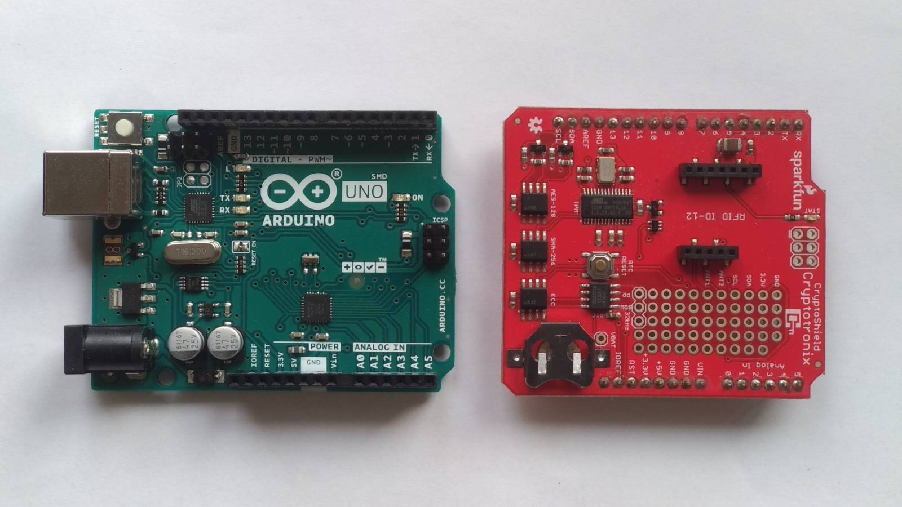

# tehagenaci: ročníkový projekt

**Názov**: Testovanie hardvérových generátorov náhodných čísiel

## Študent

**Meno**: Anton Kica

**Email**: kica6@uniba.sk

## Školiaci

**Meno**: RNDr. Richard Ostertág, PhD.

**Email**: ostertag@dcs.fmph.uniba.sk

## Cieľe projektu

1. Vyvinúť alebo nájsť vhodné existujúce aplikácie pre testovanie kvality náhodných generátorov

2. Získať náhodné dáta zo zvolených HW generátorov za rôznych podmienok, otestovať kvalitu súčiastok a pozorovať prípadné zmeny parametrov

## Výsledky projektu [2023, január]

Podarilo sa nám vyzbierať a spracovať dáta generované hardvérovými súčiastkami.

### Hardvér
- [Ardunino UNO SMD rev. 3x](https://store.arduino.cc/products/arduino-uno-rev3)
- [SparkFun CryptoShield](https://www.sparkfun.com/products/retired/13183)
  - využili sme jeho súčiastku [ATECC108](http://ww1.microchip.com/downloads/en/DeviceDoc/Atmel-8873S-CryptoAuth-ATECC108-Datasheet-Summary.pdf)

### Softvér
- [Dieharder](https://webhome.phy.duke.edu/~rgb/General/dieharder.php)
  - testovanie spoľahlivosti náhodných generátorov a postupností
- [cryptoauth-arduino](https://github.com/cryptotronix/cryptoauth-arduino)
  - knižnica na komunikáciu s ATECC108

